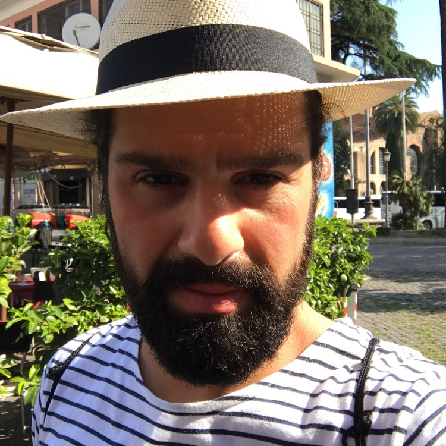

# Overview

The [Host Code Abstraction (HCA)](TODO) is a high-level programming abstraction that simplifies implementing and optimizing so-called host code which is required in modern parallel programming approaches (e.g., [CUDA](https://developer.nvidia.com/cuda-toolkit) and [OpenCL](https://www.khronos.org/opencl/)) to execute code on the devices of distributed, heterogeneous systems.

**More details will follow soon!**

 
# Publications

1.  A. Rasch, M. Wrodarczyk, R. Schulze, S. Gorlatch \\
    [OCAL: An Abstraction for Host- Code Programming with OpenCL and CUDA](https://ieeexplore.ieee.org/abstract/document/8644541?casa_token=XYcMMQCmA1sAAAAA:OxP9FJD_Gdlzz2Xu5OhB_wwgzva7VKYhFy-Y7CrM_1Zi2l8YSTvsj5Duk3Nri34gDjrndahvLhU) \\
    *IEEE International Conference on Parallel and Distributed Systems (ICPADS 2018)*\\
    <a href="../assets/files/paper/icpads18/paper.pdf"><i class="fas fa-file-pdf" style="color: red; font-size: 2em; padding-top: .4em"></i></a> [Paper](../assets/files/paper/icpads18/paper.pdf)

2.  A. Rasch, J.Bigge, M. Wrodarczyk, R. Schulze, S. Gorlatch \\
    [dOCAL: High-Level Distributed Programming with OpenCL and CUDA](https://idp.springer.com/authorize/casa?redirect_uri=https://link.springer.com/article/10.1007/s11227-019-02829-2&casa_token=XIMdqk5xl0UAAAAA:jQ39fJF1PsAT0Y-Y4iUz9qmvnRrHjh6E5YJuDlXgo2CEMv7qgR20rB8Zo1VyT6jMrRB3PIPXmhaQMnJfyA) \\
    *The Journal of Supercomputing (JOS 2019)*\\
    <a href="../assets/files/paper/jos19/paper.pdf"><i class="fas fa-file-pdf" style="color: red; font-size: 2em; padding-top: .4em"></i></a> [Paper](../assets/files/paper/jos19/paper.pdf)

 
# Contact

  

    

      
      <a href="https://arirasch.net" style="color: black"><h4><b>Ari Rasch</b></h4></a>
      <table>
        <tr><td>Affiliation:</td><td><a href="https://www.uni-muenster.de/en/">University of Münster</a></td></tr>
        <tr><td>Email:</td><td><a href="mailto:a.rasch@uni-muenster.de?cc=r.schulze@uni-muenster.de">a.rasch@uni-muenster.de</a></td></tr>
        <tr><td>Website:</td><td><a href="https://www.arirasch.net">arirasch.net</a></td></tr>
      </table>
    

  

  

    

      
      <a href="https://richardschulze.net" style="color: black"><h4><b>Richard Schulze</b></h4></a>
      <table>
        <tr><td>Affiliation:</td><td><a href="https://www.uni-muenster.de/en/">University of Münster</a></td></tr>
        <tr><td>Email:</td><td><a href="mailto:r.schulze@uni-muenster.de?cc=a.rasch@uni-muenster.de">r.schulze@uni-muenster.de</a></td></tr>
        <tr><td>Website:</td><td><a href="https://www.richardschulze.net">richardschulze.net</a></td></tr>
      </table>
    

  

